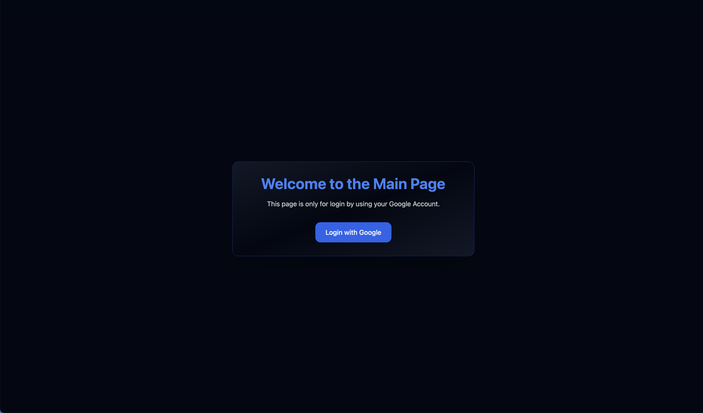
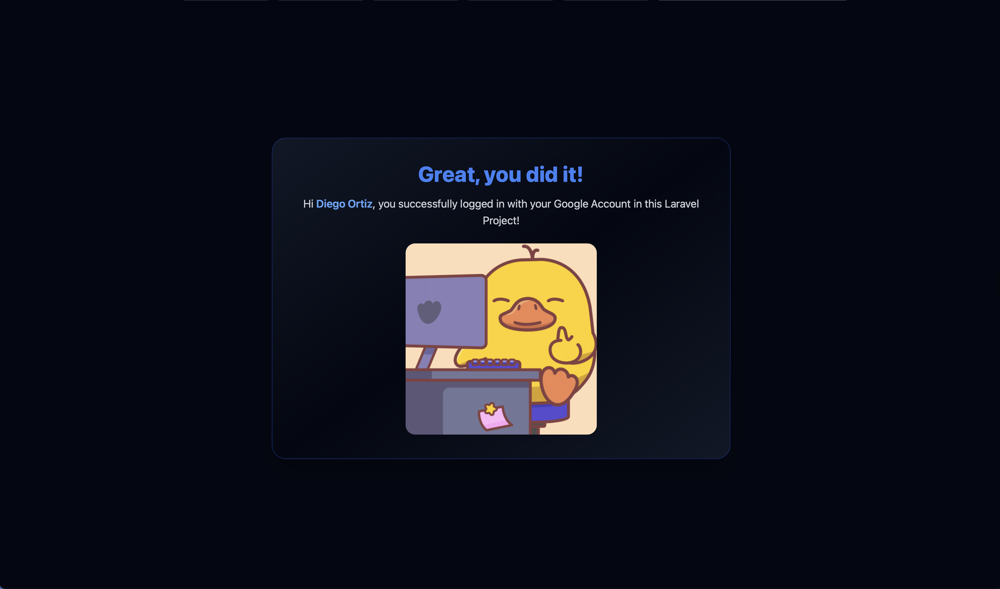

# Use of Google Authorization in Laravel

This repository demonstrates the use of Google OAuth in a Laravel application. In this example, it is used to authenticate users and retrieve their Google profile information. And display a view restricted only for users who are logged in.


## Table of Contents
- [Credits](#credits)
- [Installation](#installation)
- [Preview](#preview)


## Credits

This project is based on Abhijeet Dave's post on [How to Set Up Google Authentication in Laravel Applications | freeCodeCamp](https://www.freecodecamp.org/news/how-to-set-up-google-auth-in-laravel-apps/), due I found it very useful and I wanted to update it to the latest version of Laravel and how to use it with the latest version of Google API.

## Installation
1. Clone the repository:
  ```bash
  git clone https://github.com/DiegoAOV02/Google-Auth-Laravel.git
  ```

2. Navigate to the project directory:
  ```bash
  cd Google-Auth-Laravel
  ```
3. Install the dependencies:
  ```bash
  composer install
  ```
4. Create a `.env` file by copying the example:
  ```bash
  cp .env.example .env
  ```
5. Generate the application key:
  ```bash
  php artisan key:generate
  ```
6. Set up your Google API credentials:
   - Go to the [Google Cloud Console](https://console.cloud.google.com/).
   - Create a new project.
   - Enable the "Google+ API" and "Google People API".
   - Create OAuth 2.0 credentials and set the redirect URI to `http://your-domain.com/auth/google/callback` (if you are running it locally then `http://127.0.0.1:8000/auth/google/callback`).
   - Copy the `GOOGLE_CLIENT_ID`, `GOOGLE_CLIENT_SECRET` and `GOOGLE_REDIRECT_URL` into your `.env` file.

## Preview

If you run the application, you will see a login button that redirects you to the Google OAuth


Once you log in, you will be redirected to the home page, where you can see your profile information (Name).


